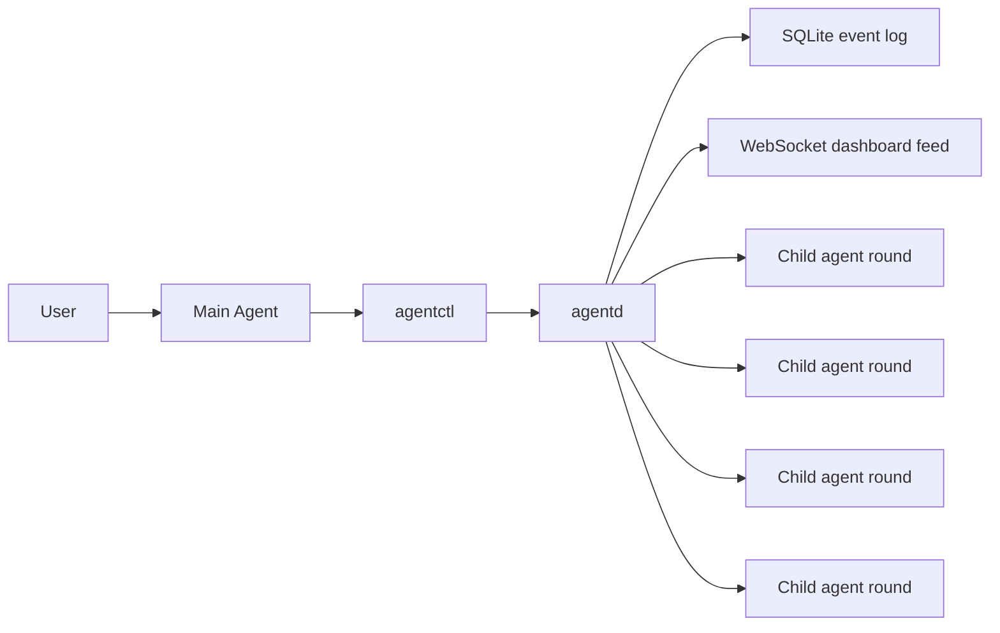

# AgentTool Design

Updated: 2026-04-09  
Status: implemented v1 backend, dashboard v1, PTY session backend pending

## 1. Goal

AgentTool is the local orchestration layer for one main Codex agent and multiple child Codex agents. It is designed for a Windows workstation where the user wants visibility, deterministic task flow, durable recovery, and less manual copy-paste between agents.

It is not a model replacement. It is a control plane.

## 2. Core decisions

### 2.1 Runtime truth is in memory

`agentd` owns the live state for:

- agents
- tasks
- decisions
- recent stream events

This is the realtime source for orchestration and dashboard rendering.

### 2.2 SQLite is a durable event ledger

SQLite is written on every important transition. It exists for:

- restart recovery
- auditability
- failure diagnosis

SQLite is not the realtime transport.

### 2.3 Runtime UI data is WebSocket-only

The dashboard does not use an HTTP data API. Runtime sync is WebSocket-only.

Current endpoint discovery:

- `agentd` binds `127.0.0.1:0` for both websocket and control sockets
- the actual ports are written to `data/runtime_endpoint.json`
- the dashboard websocket URL is therefore `ws://<runtime ws_addr>/ws`

The dashboard itself is a local static file:

- `dashboard/index.html`

The dashboard is now a lightweight control surface. In local use it is secondary to the visible panes; in remote use it becomes the primary control surface.

### 2.4 One child agent, one in-flight task

A child agent may hold only one in-flight task at a time.

The next task may be assigned only after the current one is fully `closed`.

This is stricter than `completed`.

Blocked agents are not eligible for new task assignment or ad hoc rounds until they are explicitly recovered.

## 3. Current architecture

## 4. Process model

### 4.1 `agentd`

Responsibilities:

- initialize state from SQLite
- keep runtime state in memory
- accept local control commands
- execute Codex rounds
- parse Codex JSON output
- persist events and transitions
- publish dashboard events

### 4.2 `agentctl`

Responsibilities:

- send local control requests to `agentd`
- print machine-readable responses
- avoid direct SQLite writes

### 4.3 Dashboard

Responsibilities:

- surface live communication state for open tasks between the main agent and child agents
- render current agents, tasks, decisions, and sessions
- show recent stream activity
- provide filters for active-only view, stderr hiding, and text search
- provide inspector details for linked runtime details
- allow one controlled round to a selected agent
- allow the current agent to generate and dispatch one structured task to a target executor
- reconnect automatically
- request a fresh snapshot when connected

## 5. Session backend

### 5.1 Implemented v1

The current backend uses short Codex rounds:

- first round: `codex exec --json --skip-git-repo-check --cd <cwd> <prompt>`
- continued round: `codex exec resume --json --skip-git-repo-check <thread_id> <prompt>`

`src/backend.rs` now exposes a single backend entrypoint that returns a start/stream/finish-shaped handle. The round backend is implemented behind that interface today, and the PTY branch is reserved but still unimplemented.

This gives:

- a stable `thread_id`
- structured JSON output
- deterministic per-round control
- a live stop handle per in-process session, so `agentd` can terminate the running Codex child on request
- a prompt adapter layer, so repo-local role prompts can stay human-oriented while AgentTool still gets machine-readable round payloads

### 5.2 Deferred v2

The target long-term backend is PTY-based:

- `agentd` spawns and owns visible Codex CLI sessions
- `agentd` writes to session stdin
- `agentd` reads stdout/stderr continuously
- the user can keep separate visible windows

That part is not implemented yet.

## 6. Data model

### 6.1 Agent runtime state

Per agent:

- `name`
- `role`
- `repo_name`
- `cwd`
- `prompt_path`
- `thread_id`
- `state`
- `current_task_id`
- `last_output_at`
- `last_heartbeat_at`

If `prompt_path` is not registered explicitly, `agentd` now auto-discovers `MAIN_AGENT_PROMPT.md` for the built-in `main` agent and `SUBAGENT_PROMPT.md` for child agents when those files exist under the agent cwd.

### 6.2 Task states

Supported task states:

- `pending`
- `accepted`
- `running`
- `completed`
- `reported`
- `analyzed`
- `decision_sent`
- `closed`
- `blocked_waiting_decision`
- `cancelled`
- `failed`

### 6.3 Transition rule

The critical rule is:

- a child agent is not available for another task until the current task reaches `closed`
- the same task may move from `reported` or `blocked_waiting_decision` back to `pending` after a main-agent decision, enabling repeated rounds on one long-lived work item

Operational recovery rule:

- a `failed` or `cancelled` task may be explicitly retried back to `pending`
- a blocked child agent must still be recovered separately unless the task cancel path already released it
- a persisted `thread_id` may be explicitly reset only when the agent has no in-flight task and no live session
- demo and probe records may be explicitly cleaned out of SQLite and runtime memory when they are no longer useful
- runtime repair only fixes obvious inconsistencies; it does not guess when multiple open tasks conflict

## 7. Structured task-round protocol

`run-task-round` requires the child agent to return exactly one JSON object matching:

- `schemas/task_round.schema.json`

Current payload shape:

- `status`
- `summary`
- `blocking`
- `topic`
- `details`
- `reason`
- `next_suggestion`
- `changed_files`

Supported `status` values:

- `result`
- `report`
- `wait_decision`

In the current workflow, a main-agent decision usually keeps the same task open and sends it back to `pending` for the next child round. Closing the task is explicit and separate.
The task record also carries the latest child-feedback summary, blocking level, topic, details, and round count, plus a snapshot of the latest main-agent decision id, summary, status, issuer, and issue time.
That keeps the current communication context attached to the task itself instead of forcing prompt construction or dashboard rendering to derive it from decision history each time.
The task-round prompt wrapper now also tells Codex to read the configured repo-local prompt file plus `work.md` when present, while the authoritative child/main communication state lives on the task and decision records held in memory and SQLite.

## 8. Dashboard event model

The dashboard consumes these WebSocket events:

- `snapshot`
- `agent_state_changed`
- `task_event`
- `decision_event`
- `session_event`
- `stream_chunk`

The initial `snapshot` now includes:

- `agents`
- `tasks`
- `decisions`
- `sessions`
- `recent_streams`
- `generated_at`

## 9. Error handling

Codex stdout parsing now extracts readable upstream errors from JSON events such as:

- `type = error`
- `type = turn.failed`

If a round fails, AgentTool prefers:

1. upstream JSON error message
2. latest non-empty stderr line
3. generic process status

This prevents the old failure mode where `run-task-round` only reported `exit code 1`.

## 10. SQLite tables

Current tables:

- `agents`
- `sessions`
- `tasks`
- `task_events`
- `decisions`
- `stream_events`

Current practical use:

- `sessions` tracks the lifecycle of current round-based Codex executions and is the foundation for the future PTY backend
- `stream_events` stores raw stdout/stderr lines for replay and diagnosis
- stale `running` sessions are normalized on daemon startup so recovery does not leave zombie session state

## 11. Current limitations

- No PTY-controlled long-lived Codex sessions yet
- Dashboard is intentionally lightweight; it is not a heavy visualization of model internals and not a full autonomous control plane
- No richer policy engine beyond per-task auto resolution yet
- History replay is not a current product goal; realtime communication state takes priority
- Task cancellation is deliberately conservative and does not preempt a live Codex child process; stop the session first, then cancel or retry
- Session stop currently works only for live sessions started by the current `agentd` process, not for recovered historical records
- Agent recovery is intentionally conservative: it only unlocks a `blocked` agent that has no in-flight task and no live session
- Demo cleanup intentionally targets only known demo/probe agent names instead of arbitrary pattern-driven bulk deletion
- Cleanup and repair remain explicit operator actions, not background policy

## 12. Next implementation targets

Recommended next steps:

1. add PTY-backed session management for visible Codex windows
2. add main-agent to child-agent task dispatch built on top of current state machine
3. observe the current per-task auto-resolution behavior before expanding it into a broader policy engine
4. continue tightening dashboard inspection and runtime recovery while keeping dashboard control lightweight
